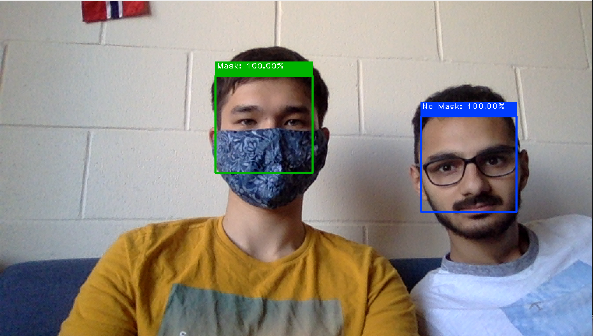

# Face Recognition Project

> An out of the box face recogniton python package designed for experiments with real-time face mask detection.

## Table of Contents

1. Getting Started
2. Folders Description
3. Usage
4. Resources
5. Acknowledgements

## Getting Started

### Installation

If you don't have **pipenv** virtualenv manager for your projects, use the command below to install
```markdown
$ pip install pipenv 
```
Make sure your present working directory is the root of the project and run the commands below. This will create a virtual environment for the project and install all required packages.
```markdown
$ pipenv install

$ pipenv shell
```

## Folders Description

### frsystem

Contains a package designed as a system for experimenting with face recognition. 


### frapp
**mask_no_mask_classifier.ipynb** a jupyter notebook that covers experiments with transfer learning to determine the best model in terms of face mask detection

**mask_recognizer.py** a program that uses frsystem and the best model (Xception) obtained from the notebook to classify a face mask on webcam.

**face_recognizer.py** a program that uses frsystem to classify known faces on webcam.

**mask_face_recognizer.py** a program that uses frsystem and the face mask model to detect known faces without a mask on webcam.

## Usage Example

#### Step 1: Add known faces to database

Adding known faces to the database that the system will recognize is possible through the following two methods:

 **Manual**
1. Camera - adding a known face through the webcam. When webcam window pops up, hit **ENTER** to take a picture of your face. Hit **ESC** to quit.

2. File - adding a known face from a .jpg file
   
**Folder Loop**

    The following directory structure is required to process images through a folder loop. For accurate face recognition add at least 5 images per person.

    ```markdown
    jpg/
       Elon Musk/
          - face1.jpg # image names can be anything
          - face2.jpg
          - face3.jpg
          - face4.jpg
          - face5.jpg
       Johnny Ive/
          - face1.jpg
		...
          - face5.jpg
    ```

**Example with folder loop**

```markdown
$ python3 add_faces.py

$ add faces to database manually or through folder loop? type '1' or '2': 2

$ Embeddings added to database.
```

### 2. Recognize known faces

After running the command below, the webcam window will pop up and display frames with detected face identities. If the person in the camera was not added to the database, it will say "Unknown".

```markdown
$ python3 MaskFaceRecognition/face_recognizer.py
```


### 3. Recognize face masks
Running the following command will display a webcam window with detected face masks ("Mask"/"No Mask").

```markdown
$ python3 MaskFaceRecognition/mask_recognizer.py
```



### 4. Recognize face masks or known faces

Running the following command will display a webcam window with detected face masks. If a face mask is not present on the face, it will detect person's name if known, otherwise "Unknown" label will be displayed.

```markdown
$ python3 MaskFaceRecognition/mask_face_recognizer.py
```


## **Resources**

### **DataCamp**

[Introduction to Python for Data Sceince](https://learn.datacamp.com/courses/intro-to-python-for-data-science)

[Manipulating Data Frames with pandas](https://learn.datacamp.com/courses/manipulating-dataframes-with-pandas)

[Data Types for Data Science in Python](https://learn.datacamp.com/courses/data-types-for-data-science-in-python)

[Intermediate Python](https://learn.datacamp.com/courses/intermediate-python)

[Image Processing with Keras](https://learn.datacamp.com/courses/image-processing-with-keras-in-python)

[Introduction to Deep Learning with Keras](https://learn.datacamp.com/courses/introduction-to-deep-learning-with-keras)

[Advanced Deep Learning with Keras](https://learn.datacamp.com/courses/advanced-deep-learning-with-keras)

### **Readings**

[Modern Face Recognition with Deep Learning](https://medium.com/@ageitgey/machine-learning-is-fun-part-4-modern-face-recognition-with-deep-learning-c3cffc121d78)

[Illustrated: 10 CNN Architectures](https://towardsdatascience.com/illustrated-10-cnn-architectures-95d78ace614d#c5a6)

[A Comprehensive Hands-on Guide to Transfer Learning with Real-World Applications in Deep Learning](https://towardsdatascience.com/a-comprehensive-hands-on-guide-to-transfer-learning-with-real-world-applications-in-deep-learning-212bf3b2f27a)

### **Tutorials**

[Face Detection with Open CV](https://www.datacamp.com/community/tutorials/face-detection-python-opencv)

[ImageNet: VGGNet, ResNet, Inception, and Xception with Keras](https://www.pyimagesearch.com/2017/03/20/imagenet-vggnet-resnet-inception-xception-keras/)

[How to Configure Image Data Augmentation in Keras](https://machinelearningmastery.com/how-to-configure-image-data-augmentation-when-training-deep-learning-neural-networks/#:~:text=The%20Keras%20deep%20learning%20neural,augmentation%20via%20the%20ImageDataGenerator%20class.&text=Image%20data%20augmentation%20is%20used,of%20the%20model%20to%20generalize.)

[Face Mask Detector with OpenCV, Keras/TensorFlow, and Deep Learning](https://www.pyimagesearch.com/2020/05/04/covid-19-face-mask-detector-with-opencv-keras-tensorflow-and-deep-learning/)

## Acknowledgements

This project is a part of James Rocco Research Scholarship provided by Lake Forest College and was carried out under the supervision of Prof. Arthur Bousquet PhD.